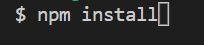
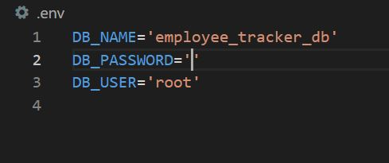
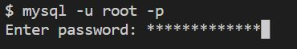
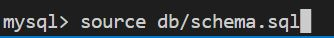
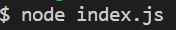
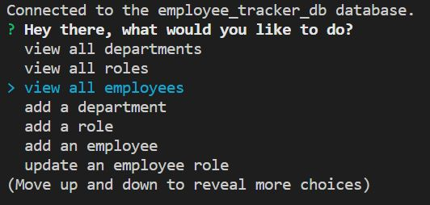
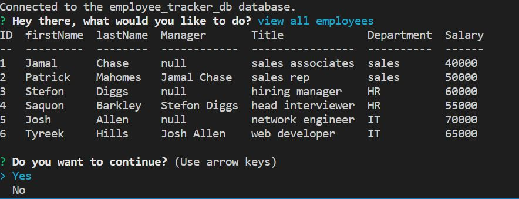
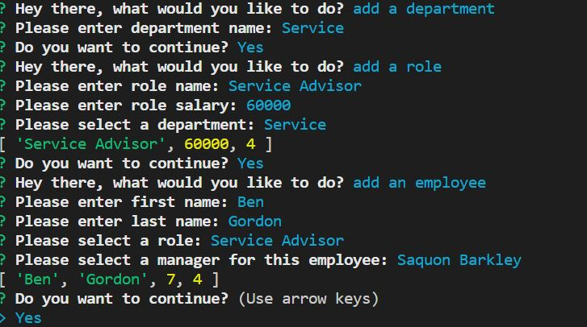
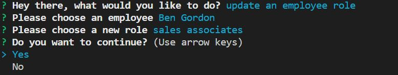

# Employee-Tracker

## Description

- This is an application for a small company to keep track of its employees and their relative roles and departments.
- This app is powered by a MySQL database.
- Users can view departments, all company roles, and all employees.
- Users can also create departments, roles, employees as well as updating employee information.

## Table of content

- [Installation](#installation)
- [Usage](#usage)
- [Credits](#credits)
- [License](#license)

## Installation

- Before using the application, in the terminal, use npm install to install packages needed for this application.

- Create an .env file to store sensitive information such as database name, username, and your password to access the database.

## Usage

- Link to the demo video [https://app.castify.com/view/02ff922a-4c20-4178-a1c6-d4b91c80c76d](https://app.castify.com/view/02ff922a-4c20-4178-a1c6-d4b91c80c76d)

- Link to the Github Repository [https://github.com/BranBao1995/Employee-Tracker](https://github.com/BranBao1995/Employee-Tracker)

- Log into your MySQL database by typing in the terminal mysql -u root -p and then enter your password:

- Initialize your database by typing source db/schema.sql

- Populate seed data by typing source db/seeds.sql

- In the terminal, run node index.js to start the application:

- Select a task you want to do, in the case I will do "view all employees":

- You may also want to add a department, a role, or an employee:

- You can also update an employee's information:

## Credits

- Author's Github Profile: [https://github.com/BranBao1995](https://github.com/BranBao1995)

## License 

The MIT License

Copyright (c) [2022] [Hongdong Bao]

Permission is hereby granted, free of charge, to any person obtaining a copy
of this software and associated documentation files (the "Software"), to deal
in the Software without restriction, including without limitation the rights
to use, copy, modify, merge, publish, distribute, sublicense, and/or sell
copies of the Software, and to permit persons to whom the Software is
furnished to do so, subject to the following conditions:

The above copyright notice and this permission notice shall be included in all
copies or substantial portions of the Software.

THE SOFTWARE IS PROVIDED "AS IS", WITHOUT WARRANTY OF ANY KIND, EXPRESS OR
IMPLIED, INCLUDING BUT NOT LIMITED TO THE WARRANTIES OF MERCHANTABILITY,
FITNESS FOR A PARTICULAR PURPOSE AND NONINFRINGEMENT. IN NO EVENT SHALL THE
AUTHORS OR COPYRIGHT HOLDERS BE LIABLE FOR ANY CLAIM, DAMAGES OR OTHER
LIABILITY, WHETHER IN AN ACTION OF CONTRACT, TORT OR OTHERWISE, ARISING FROM,
OUT OF OR IN CONNECTION WITH THE SOFTWARE OR THE USE OR OTHER DEALINGS IN THE
SOFTWARE.
